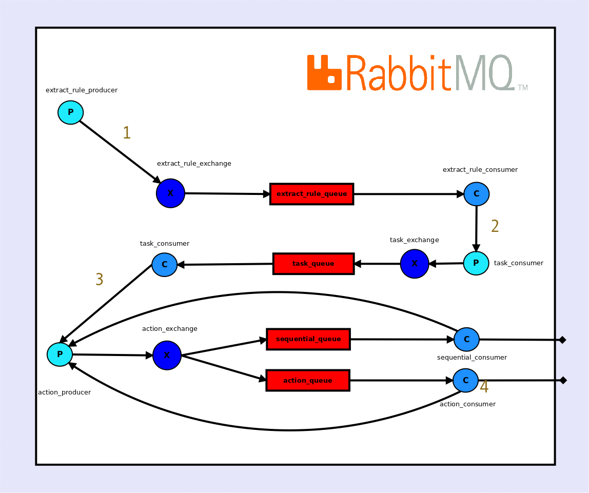

IDCITaskBundle
=============

The purpose of this bundle is to add an easy way to asynchronously process CPU-intensive scripts. You might be used to cron jobs to solve this kind of problems.
This bundle use RabbitMq which solve those issues more efficiently and more effectively.
A CPU-intensive script is called an [action](https://github.com/IDCI-Consulting/TaskBundle/blob/master/Resources/doc/how_to_create_action_service.md). To keep traces on actions, this bundle uses monolog to store the action logs in MongoDB.
If you want to understand how this bundle works, you need the basics about [RabbitMQ](http://www.rabbitmq.com/documentation.html).

- [Introduction](#introduction)
    - [Glossary](#glossary)
    - [Simple schema](#simple-schema)
    - [Lifecycle of a task with RabbitMq](#lifecycle-of-a-task-with-rabbitmq)
- [Installation](#installation)
- [Run the tests](#run-the-tests)
- [How to create an extract rule service](Resources/doc/how_to_create_extract_rule_service.md)
- [How to create an action service](Resources/doc/how_to_create_action_service.md)
- [How to create a task configuration object](Resources/doc/how_to_create_task_configuration_object.md)
- [How to run tasks](Resources/doc/how_to_run_tasks.md)
- [How to scale your application to run tasks concurrently](Resources/doc/scalability.md)
- [How to separate actions in different applications](Resources/doc/routing.md)
- [Example](Resources/doc/example.md)
- [UML](Resources/doc/uml.md)

Introduction
------------

### Glossary

* An **extract_rule** refers to a symfony service that will retrieve an array of data. A task will be created for each item of this array.
* An **action** is a service doing any work you want. It can be triggered by other previous actions in a definable and predictable order (composing what we call a workflow).
* A **workflow** refers to the way actions are linked together. You can use conditions depending of the results of previous actions to trigger an action or another.
* A **task** refers to multiple actions linked together for one extracted data. It's a mongo document, and can be used to resume actions if they failed0
* With all these, we can compose a **task configuration** to define how tasks are created and processed.

### Simple schema

Here is a simple schema that will help get a picture of how tasks are created and processed.
Each arrow can represent a RabbitMq message that is sent and will be consumed.


### Lifecycle of a task with rabbitmq

A task can be created in 2 different ways. The processor service is the entrypoint of this bundle. See the ["How to run tasks"](Resources/doc/how_to_run_tasks.md) part of the documentation for more details.

**A single action with some (or no) data to process**


* 1 - The **task producer** send a message with the name of an action and some data (or no data).
* 2 - The **task consumer** create a single task from these data and use the **action producer** to send the created task.
* 3 - The **action consumer** retrieve the task to run the single action.

**A complex configuration with a workflow and multiple actions**



* 1 - The **extract_rule producer** send a message to RabbitMQ with the name of the extract rule service.
* 2 - The **extract rule consumer** extract the data and use the **task producer** to send a message with the data array.
* 3 - The **task consumer** create the tasks for each item in the extracted data array, and use the **action producer** to send the created task.
* 4 - The **action consumer** read the configuration to run the action depending on the workflow. An action can lead to another one or just end the process.

Installation
------------

Add dependencies in your `composer.json` file:
```json
"require": {
    ...,
    "idci/task-bundle": "dev-master",
}
```

Enable bundles in your application kernel:
```php
<?php
// app/AppKernel.php

public function registerBundles()
{
    $bundles = array(
        // ...
        new IDCI\Bundle\TaskBundle\IDCITaskBundle(),
        new Doctrine\Bundle\DoctrineBundle\DoctrineBundle(),
        new Doctrine\Bundle\MongoDBBundle\DoctrineMongoDBBundle(),
        new IDCI\Bundle\AssetLoaderBundle\IDCIAssetLoaderBundle(),
        new FOS\RestBundle\FOSRestBundle(),
        new JMS\SerializerBundle\JMSSerializerBundle(),
        new OldSound\RabbitMqBundle\OldSoundRabbitMqBundle(),
    );
}
```

Import the bundle configuration:
```yml
# app/config/config.yml

imports:
    - { resource: @IDCITaskBundle/Resources/config/config.yml }

doctrine:
    dbal:
        default_connection: default
        connections:
            default:
                driver:   pdo_mysql
                host:     "%database_host%"
                port:     "%database_port%"
                dbname:   "%database_name%"
                user:     "%database_user%"
                password: "%database_password%"
                charset:  UTF8

    orm:
        auto_generate_proxy_classes: "%kernel.debug%"
        default_entity_manager: default
        entity_managers:
            default:
                connection: default
                mappings:
                    IDCITaskBundle: ~
```

Update your parameters.yml file
```yml
application_name: 'Task Runner'
task_database_host: localhost
task_database_port: ~
task_database_name: task_manager
task_database_user: dbuser
task_database_password: dbpwd
task_rabbitmq_host: localhost
task_rabbitmq_port: 5672
task_rabbitmq_user: user
task_rabbitmq_password: password
task_rabbitmq_lazy: false
task_rabbitmq_vhost: /
task_mongo_database_name: task
task_mongo_database_host: 'mongodb://127.0.0.1:27017'
```

Run the tests
-------------

Install bundle dependencies:
```sh
$ make composer-update
```

To execute unit tests:
```sh
$ make phpunit
```
