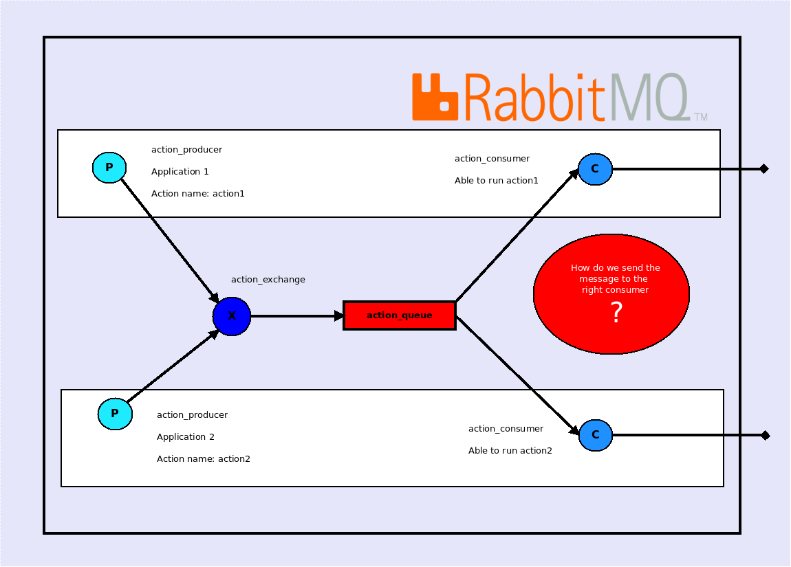
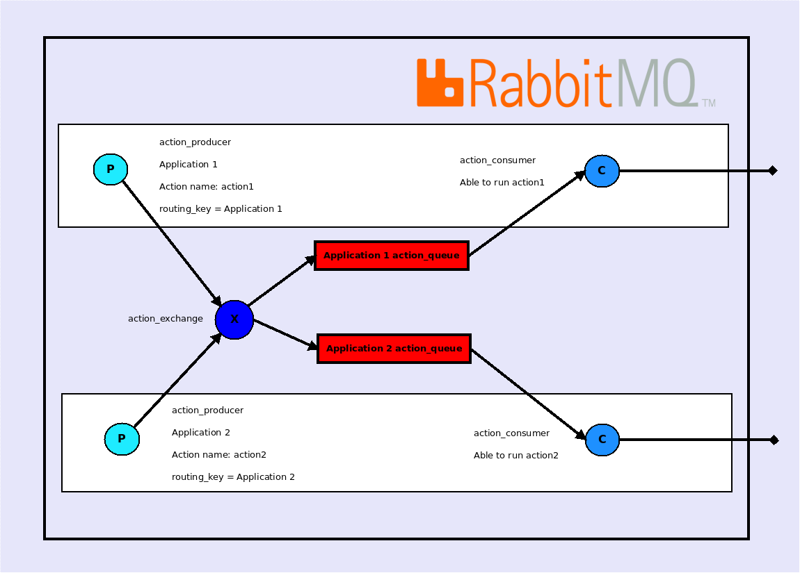

How to separate actions in different applications
=================================================

You will likely want to use this bundle if you have got so many cron jobs that it's becoming hard to scale and manage.
With this in mind, you might already have multiple Symfony applications with Commands used in those cron jobs.

You might want to think: "I have to create an application based on this bundle that will contains all my actions and extract rules.
I need to move the code of my commands into actions in that application. That application will centralized all my actions (jobs)".

* Where you are right: you need to move the code of your symfony commands in actions. If you split your code in services, it should be very easy.
* Where you are wrong: you don't need to create a new application based on this bundle. You only need to add this bundle to your existing application and configure the bundle correctly to connect your application to the RabbitMQ server and the Mongo database.

How does it works?
------------------

Let's consider the following schema:

You have 2 symfony applications running on different servers.
When a producer send a message, the exchange forward it to the action queue. With this setup, RabbitMQ will just send the message to the first available consumer.
See the documentation about [scalability](scalability.md) to understand how RabbitMQ takes advantage of multiple consumers.

That is where the **application_name** parameter comes in. The application_name parameter will be used as a [routing_key](https://www.rabbitmq.com/tutorials/tutorial-four-php.html), and a queue will be named according to that key and bound to the exchange thanks to that routing key.
You can see [the configuration](https://github.com/IDCI-Consulting/TaskBundle/blob/master/Resources/config/config.yml#L25-L28)
as well as an [example of use of producer](https://github.com/IDCI-Consulting/TaskBundle/blob/master/Processor/RabbitMqProcessor.php#L72) for a better comprehension on this subject.

Here is what's happening:

Summary
-------

- [Introduction](../../README.md#introduction)
    - [Glossary](../../README.md#glossary)
    - [Simple schema](../../README.md#simple-schema)
    - [Lifecycle of a task with RabbitMq](../../README.md#lifecycle-of-a-task-with-rabbitmq)
- [Installation](../../README.md#installation)
- [Run the tests](../../README.md#run-the-tests)
- [How to create an extract rule service](how_to_create_extract_rule_service.md)
- [How to create an action service](how_to_create_action_service.md)
- [How to create a task configuration object](how_to_create_task_configuration_object.md)
- [Persist a task configuration](persist_task_configurations.md)
- [Use the task configuration form type](editors.md)
- [How to run tasks](how_to_run_tasks.md)
- [How to scale your application to run tasks concurrently](scalability.md)
- [How to separate actions in different applications](routing.md)
- [Example](example.md)
- [UML](uml.md)
