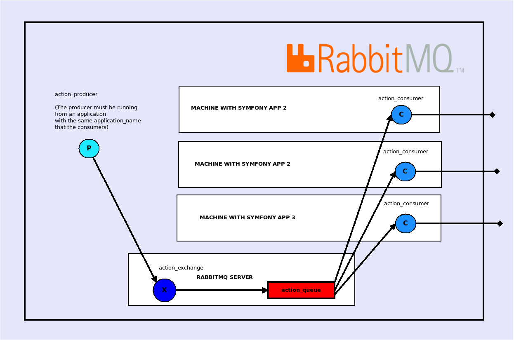

How to scale your application to run tasks concurrently
=======================================================

This bundle is intended to be used in applications that might need to handle millions of tasks, each task with several actions.
How can we scale our application and really take advantage of what RabbitMQ was made for?

What you need is only to set up a new machine with the same symfony application, i.e.: the same extract_rules and actions, and the same configuration
(which means connected to the same RabbitMQ server to handle the messages, and the same Mongo database to store logs an tasks). Run a consumer for each machine.

The following schema sums it up, with 3 machines running a consumer:

What we just did in order to achieve that was to specify
in the [configuration](https://github.com/IDCI-Consulting/TaskBundle/blob/master/Resources/config/config.yml#L30)
that RabbitMQ should not to give more than one message to a consumer at a time. This is called [round robin](https://en.wikipedia.org/wiki/Round-robin_scheduling)

/!\ Note that the producer must be running on an application with the same **application_name** than the consumers. More on that on the [routing part of the documentation](routing.md)

Summary
-------

- [Introduction](../../README.md#introduction)
    - [Glossary](../../README.md#glossary)
    - [Simple schema](../../README.md#simple-schema)
    - [Lifecycle of a task with RabbitMq](../../README.md#lifecycle-of-a-task-with-rabbitmq)
- [Installation](../../README.md#installation)
- [Run the tests](../../README.md#run-the-tests)
- [How to create an extract rule service](how_to_create_extract_rule_service.md)
- [How to create an action service](how_to_create_action_service.md)
- [How to create a task configuration object](how_to_create_task_configuration_object.md)
- [Persist a task configuration](persist_task_configurations.md)
- [How to run tasks](how_to_run_tasks.md)
- [How to scale your application to run tasks concurrently](scalability.md)
- [How to separate actions in different applications](routing.md)
- [Example](example.md)
- [UML](uml.md)
