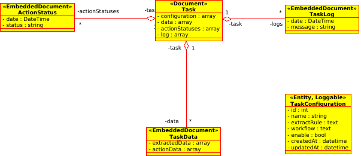
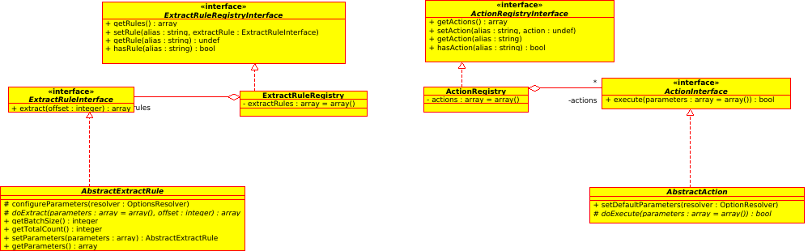

UML
===

- [Introduction](../../README.md#introduction)
    - [Glossary](../../README.md#glossary)
    - [Lifecycle of a task](../../README.md#lifecycle-of-a-task)
- [Installation](../../README.md#installation)
- [Run the tests](../../README.md#run-the-tests)
- [How to create an extract rule service](create_extract_rule_service.md)
- [How to create an action service](create_action_service.md)
- [How to create a task configuration object](create-task-configuration-object.md)
- [Running tasks](running-tasks.md)
- [Example](example.md)
- [UML](uml.md)

Entities
--------

Registries
----------

